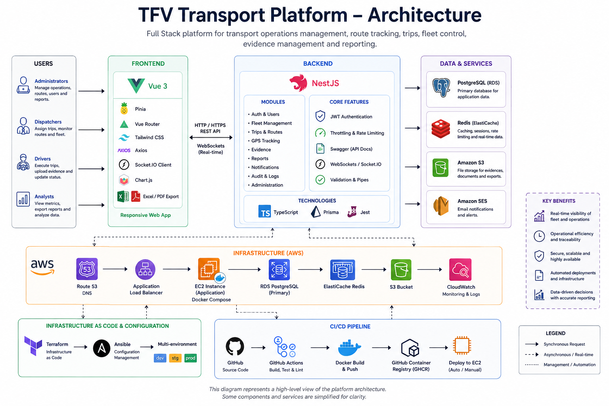

# 🚐 Transportation Management Platform — Case Study

A Full Stack transportation operations platform designed to digitize and centralize workflows that were previously handled through manual records and fragmented processes.

The platform was developed collaboratively by a development team, with my participation as **Full Stack Developer & Project Lead**.

This repository is a **public technical case study**. The production source code, infrastructure configuration, operational data, credentials, and client-specific information remain private.

---

## 🚀 Project Overview

The platform supports the digital management of transportation operations through a web application used by different operational and administrative roles.

The system combines trip management, GPS route tracking, operational records, evidence management, reporting, exports, vehicle-related workflows, and administrative tools in a single platform.

The application was developed as three private codebases:

```text
Frontend        Backend         Infrastructure
Vue 3           NestJS          Terraform
Pinia           Prisma          Ansible
Tailwind CSS    PostgreSQL      Docker Compose
Axios           Redis           AWS
Socket.IO       WebSockets      GitHub Actions
```

---

## 👩‍💻 My Role

**Full Stack Developer & Project Lead**

This platform was developed collaboratively by a multidisciplinary development team.

I participated as a Full Stack Developer while also coordinating the project and the development team. My responsibilities included organizing and following up on development tasks, coordinating frontend, backend and infrastructure work, supporting technical decisions, reviewing progress, and helping ensure the different parts of the platform were correctly integrated.

Alongside the coordination role, I contributed directly to the development and continuous improvement of the application, including frontend functionality, backend integration, operational workflows, debugging, deployment-related tasks, and production-oriented improvements.

The project provided hands-on experience building and maintaining a production-oriented business application with multiple user roles, cloud infrastructure, real-time communication, data persistence, exports, and GPS-based functionality.

---

## ✨ Core Capabilities

### 🚐 Transportation Operations

- Digital trip registration and management
- Trip history and operational traceability
- GPS-based route tracking
- Route visualization on maps
- Driver-oriented trip workflows
- Administrative transportation management

### 📍 GPS Tracking

The application records GPS coordinates during active trips and uses those points to reconstruct and visualize travelled routes.

The frontend includes logic for synchronizing GPS points during a trip and handling pending coordinates when a trip is finalized, helping preserve route information even when connectivity or session timing introduces synchronization challenges.

### 📊 History, Filters & Exports

Operational history can be reviewed using filters and exported for reporting purposes.

The frontend includes tooling for:

- PDF generation
- Excel exports
- Filtered trip-history reports
- Map information in reporting workflows
- Document preview and download-related workflows

### 📎 Evidence Management

The platform includes an evidence module that allows operational records to be supported with attached files and reviewed through an administrative workflow.

### 🚘 Vehicle & Maintenance Workflows

Administrative modules include vehicle-related information and maintenance-oriented workflows, including checklist and reporting functionality.

### 👥 Role-Based Experience

The application exposes different navigation and functionality depending on the authenticated user's role, allowing operational users and administrative users to access workflows relevant to their responsibilities.

---

## 🛠️ Technology Stack

### Frontend


Additional frontend technologies:

- Axios
- Socket.IO Client
- Chart.js
- ExcelJS
- jsPDF
- PDF.js
- XLSX

### Backend


Additional backend technologies:

- JWT / Passport
- Redis
- WebSockets / Socket.IO
- AWS S3 SDK
- Swagger / OpenAPI
- Class Validator
- Jest

### Cloud & DevOps


---

## 🏗️ System Architecture



*High-level view of the platform architecture, application services, AWS infrastructure, and CI/CD workflow.*

<details>
<summary>Text-based architecture overview</summary>

```text
┌──────────────────────────────┐
│          Vue 3 + Vite        │
│   Pinia · Tailwind · Axios   │
│       Socket.IO Client       │
└──────────────┬───────────────┘
               │
        REST API / WebSockets
               │
               ▼
┌──────────────────────────────┐
│            NestJS            │
│ JWT · Prisma · WebSockets    │
│ Redis · Swagger · AWS SDK    │
└───────┬────────┬─────────────┘
        │        │
        ▼        ▼
 PostgreSQL    Redis
   (RDS)      Cache / realtime
        │
        └──────────────┐
                       ▼
                    AWS S3
                Object storage
```

</details>

---

## ☁️ Infrastructure Architecture

The infrastructure is defined as code and supports separate application environments.

```text
GitHub
   │
   │ GitHub Actions
   ▼
GHCR Container Images
   │
   ▼
AWS EC2
   │
   ├── Docker Compose
   │     ├── Frontend
   │     └── Backend API
   │
   ├──────────────► RDS PostgreSQL
   │
   └──────────────► Amazon S3

Terraform
   │
   ├── VPC / Subnets / Routing
   ├── EC2 / Elastic IP
   ├── RDS
   ├── S3
   ├── Security Groups
   └── IAM

Ansible
   │
   └── Server provisioning and application deployment
```

The infrastructure workflow includes **development, test, and production environments**, container images hosted in **GitHub Container Registry (GHCR)**, and automated deployment through **GitHub Actions**.

---

## 🔄 Deployment Workflow

```text
Code Change
    │
    ▼
GitHub Repository
    │
    ▼
GitHub Actions
    │
    ├── Build application
    ├── Build Docker image
    └── Publish image to GHCR
              │
              ▼
          AWS EC2
              │
              ▼
       Docker Compose
```

Terraform manages the AWS resources while Ansible handles server provisioning and application configuration.

---

## 🧪 Testing & Quality

The NestJS backend includes Jest-based testing infrastructure with support for unit testing, coverage reports, debugging, and end-to-end test configuration.

The project also involved iterative debugging and production-oriented improvements related to authentication, GPS synchronization, reporting, exports, responsive user interfaces, and operational workflows.

---

## 📸 Product Screenshots

Screenshots and visual documentation will be added to this case study using **anonymized or recreated data only**.

Planned examples include:

- Administrative dashboard
- Trip history
- GPS route visualization
- Operational trip workflow
- Evidence management
- Reporting and exports

---

## 🔒 Confidentiality

This repository intentionally **does not contain the production source code**.

The following information remains private:

- Application source repositories
- Customer and organization information
- User and employee data
- Vehicle identifiers and operational records
- Addresses and route-specific business data
- Credentials and environment secrets
- Terraform state and production infrastructure values

The purpose of this repository is exclusively to document the **technical architecture, engineering decisions, technologies, and development experience** behind the platform.

---

## 📌 Repository Status

This case study is maintained as part of my **software development portfolio**. Additional architecture documentation and anonymized product visuals may be added over time.

---

## 👩‍💻 Portfolio Owner

**Luisa Vargas**  
Full Stack Developer & Project Lead

[](https://www.linkedin.com/in/luisa-vargas-233494200/)
